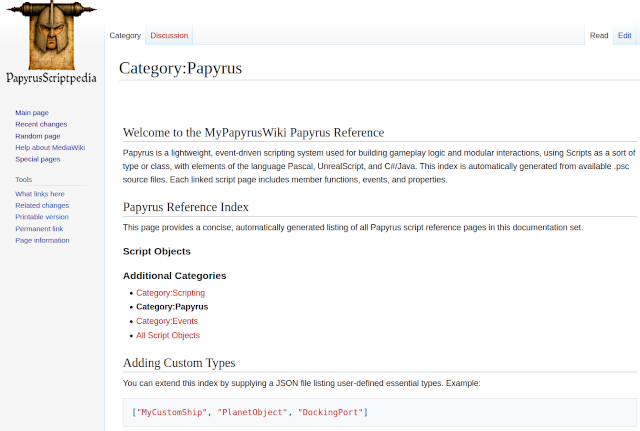
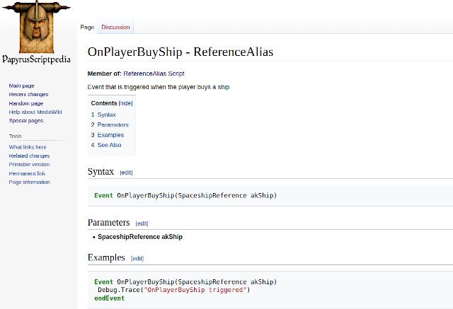
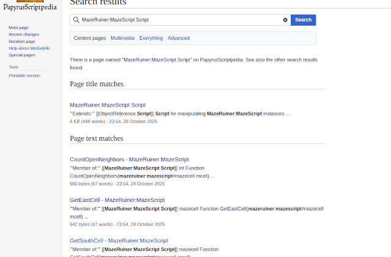

# ReedPapyri — Papyrus Documentation & Wiki Toolchain

ReedPapyri is a powerful & condensed Python toolchain for generating wikis and managing documentation for Papyrus scripts used in Bethesda games and mods, and used one way, ReedPapyri turns Bethesda Papyrus scripts into a fully browsable MediaWiki in a couple of commands — a modern, open-source replacement for the lost Creation Kit Wikis, and a way to personally curate your own scripting functions, or freeze API documentation to different builds of a game.

[](https://github.com/)
[](https://github.com/)
[](LICENSE)
[](https://www.python.org/)

## Overview
```ReedPapyri``` is a powerful Python toolchain for generating wikis (a sort of loose folder of ``*.psc`` Papyrus source files to configured and live Wiki runtime compiler) and managing documentation for Papyrus scripts used in Bethesda games and mods. ReedPapyri is especially useful for Starfield, which has for several years lacked a comprehensive community scripting reference wiki, but it can be used with other Bethesda games (e.g. Fallout 4) as well. 

ReedPapyri helps modders create their own detailed documentation for Starfield's scripting systems and potentially even host separate knowledge bases for large mods. This way if you prefer having a Skyrim or Fallout 4 style Starfield wiki you can build your own from the script sources you have installed with the game (e.g. ```ls /mysteaminstalldirectory/steamapps/common/Starfield/Data/scripts/source```).

## 🖼️ Visual Examples

Below are two illustrative images from the `artistic/` directory, showing the kinds of generated wiki and documentation pages ReedPapyri can produce.

### 📚 Category Example
Displays the autogenerated *Papyrus Category* index page produced during documentation export with the ``--index`` switch on.



### 🚀 Ship Transaction Example
Shows an example script documentation page for a game event, such as `OnPlayerBuyShip` from Starfield, demonstrating how ReedPapyri formats functions and parameters.



### 🔍 Search Through Mod-Added Types Example
Displays a search scoped to a custom mod-added game Script (type) or Papyrus namespace, showing that you don't just have to stick to the original base game files.




If you're a modder with your own Papyrus alternate universe or scripting armamentaria, you can see them documented in all of the glory of the standard Papyrus library scripting primitives you used to build them (which is a reminder that in Papyrus you are really making new types, not just scripts!). 

This tool is Linux focused, in some celebration of the fact that Proton's kernel32 support has extended to things like CopyFile2 so that we don't necessarily need weird shim or IAT shenanigans to use much of the Creation Kit anymore.

* Multiple Export Modes: Generate documentation in MediaWiki (.wiki), SQL databases, ZIP archives, or MediaWiki XML dumps.
* Auto-linking and auto-indexing documentation like the unavailable official Papyrus Wikis for Fallout 4 and Skyrim.
* Unattended MediaWiki installation! (mostly just one invocation, a docker-compose up, and sign into your own personal wiki).
* Dynamic custom Pygments injection with a Papyrus lexer / grammar and style, so you can have Papyrus syntax highlighting in a wiki!

### Experimental Features

* Decompilation (invocation) support: The ability to decompile .pex files into .psc is experimental and might not work for all cases.

## Installation

Clone the repository:

```
git clone https://github.com/your-username/ReedPapyri.git
cd ReedPapyri
```

> remember it's best to make a clean working directory

Install dependencies:
```pyyaml```, ```sqlite3```, ```pygments``` (optional), ```docker``` (optional), ```pyparsing``` (optional/experimental), ```psycopg2``` (optional)

Ensure Docker is installed if using the Docker setup.

(Optional) Set up a Papyrus decompiler, like ```Champollion.exe``` if you wish to decompile .pex files.

## Usage


### Example 1: Export to SQL Database

This example stores documentation in a SQL database (sqlite), including an auto-generated index.
This is the place to start for enabling fun programmatic analyses or web visualizations.

```
python3 reedpapyri.py . ./StarDocBase --index --mode sql --db-conn ./StarDocBase/lightspeed.db --db-dialect sqlite
```

Output:
```
🔧 ReedPapyri — Papyrus Documentation & Wiki Toolchain
📂 Scanning directory: .
📄 Parsing Actor.psc
✅ Stored Actor in SQL database
📄 Parsing ObjectReference.psc
✅ Stored ObjectReference in SQL database
✅ Added index page → Category:Papyrus (via SQLDocSink)
💾 Saved SQL database → ./StarDocBase/lightspeed.db
✅ Completed: 2 Papyrus scripts processed in mode 'sql'.
🎆 Done.
```
### Example 2: Export to MediaWiki XML Format

Generate a MediaWiki XML dump for importing into a MediaWiki instance, using Docker for the setup.
This is the native format used by MediaWiki software when you export or import multiple pages at once, ideal for Special: pages wiki clickops.

```
python3 reedpapyri.py . ./StarDocBase --index --mode xml
```

### Example 3: Export to ZIP Archive

Create a ZIP archive of .wiki files. This mode is useful for distributing documentation or merging it or searching through it (e.g. with rg) in your terminal.

```
python3 reedpapyri.py . ./StarDocBase --index --mode zip
```


### Example 4: Generate MediaWiki Wiki Files

Generate MediaWiki .wiki files, including a sidebar and an index page.
These are the individual page files, best for copying into Wiki source editors on ones you are a member of, or AI analyses.

```
python3 reedpapyri.py . ./StarDocBase --index --mode wiki
```

## Command-Line Switches

Below is a table describing all available command-line switches for **ReedPapyri**.

```
usage: reedpapyri.py psc_or_dir out [--mode {wiki,sql,zip,xml}] [options]
```

| Switch | Description |
|--------|-------------|
| `psc_or_dir` | Path to a `.psc` file or directory (e.g., `.` to scan current folder). |
| `out` | Output directory or target file (e.g., `./Output`, `StarbaseWiki3`). |
| `--mode {wiki,sql,zip,xml}` | Output mode: generate documentation in `.wiki`, `.sql`, `.zip`, or `.xml` format. |
| `--db-conn DB_CONN` | SQL connection string or path (required if `--mode=sql`). |
| `--db-dialect {sqlite,postgres}` | Database dialect for SQL mode (`sqlite` default). |
| `--index` | Generate `Category:Papyrus` index after documentation is built. |
| `--user-types PATH` | Path to JSON file defining user-defined types for linking. |
| `--project-name NAME` | Project name for index pages and Docker setup (default: `PapyrusDocs`). |
| `--docker` | Generate `docker-compose.yml` for hosting documentation in MediaWiki. |
| `--ssl` | Enable HTTPS (via Caddy in Docker). |
| `--domain DOMAIN` | Domain for HTTPS setup (default: `localhost`). |
| `--email EMAIL` | Email address for Let’s Encrypt SSL certificate registration. |
| `--db` | Include database container (MariaDB) in Docker compose stack. |
| `--wiki-user USERNAME` | Contributor username for MediaWiki XML exports. |
| `--wiki-name TITLE` | Display name for the generated wiki (default: “Papyrus Docs Wiki”). |
| `--wiki-base URL` | Base URL for the MediaWiki instance (used in XML exports). |
| `--install-syntax-highlighting` | Install Papyrus syntax highlighting extension into MediaWiki (requires external build step). |
| `--no-marker` | Disable invisible generation markers in `.wiki` output. |
| `--no-marker-seconds` | Truncate generation marker timestamps to minute precision (less noisy diffs). |
| `--syntax-language LANG` | Syntax highlighting language (default: `papyrus`). |
| `--preproc-foreign-decompiler` | Run a pre-processing step to decompile `.pex` files into `.psc` before documentation. |
| `--foreign-decompiler-path PATH` | Path to external decompiler executable (default: `./Decompiler.exe`). |
| `--foreign-decompiler-runner CMD` | Optional wrapper for non-Windows execution (e.g., `wine`, `proton run`). |
| `--foreign-decompiler-force-decompile` | Force re-decompilation even if `.psc` is newer than `.pex`. |
| `--foreign-decompiler-env VAR=VALUE [...]` | Extra environment variables for the decompiler (e.g., `WINEPREFIX=~/.wine`). |
| `--parser {regular,pyparsing}` | Parser engine to use: `regular` (default) or `pyparsing` (experimental). |
| `--no-autoimport-copy` | Skip copying generated XML into `AutoFirstRunImport.xml` for Docker auto-import. |
| `--init-wikibuildcontext` | Generate missing wiki context files (`papyruslexerconjecture.py`, `wiki.png`) after Docker setup. |
| `--dockerport-randomize` | Randomize Docker port assignments for running multiple instances. |
| `--dockerport-portmw N` | Host port for MediaWiki HTTP service (default: `40201`). |
| `--dockerport-portdb N` | Host port for MariaDB service (default: `30433`). |
| `--sqlsink-enable-batch` | Enable SQL sink batch write mode. |
| `--sqlsink-batch-id ID` | Logical batch ID for SQL sink (useful for multi-run identification). |
| `--sqlsink-batch-size N` | Flush size for batched SQL writes (default: 500). |
| `--docker-wikilogo PATH` | Path to a custom PNG logo for the Docker MediaWiki build. If omitted, a dummy logo is generated. |


## Docker Compose generation

ReedPapyri can generate a Docker Compose environment for hosting the documentation using MediaWiki and Pygmentize for syntax highlighting, with a MariaDB backend. Note: the ```--docker``` switch always uses XML export ```--mode```, even if other modes like ```wiki``` or ```zip``` are specified.

To Generate Docker Setup:
```
$python reedpapyri.py ./PapyrusScripts ./WikiOutput   --mode xml   --docker   --project-name "MyPapyrusWiki" --index --init-wikibuildcontext --wiki-name "PapyrusScriptpedia" --install-syntax-highlighting
```

A large amount of emoji-laden progress notifications will attempt to apprise you of the various built artifacts which get "compiled".

You will be asked to confirm that you understand your docker-compose setup will be pulling in 3rd party containers (MediaWiki, MariaDB) when you later ```docker-compose up```.

Your "wiki build context" will be your output directory, but with a premade logo (if you do not have one, one will be provided for you, but I recommend putting the more artistic one in there after the placeholder .png is generated), and a xml file (the one you generate and a staged copy, AutoFirstRunImport.xml), as well as a docker-compose.yml YAML file that is specialized in advanced unattended mediawiki installation and is the hard-won spoils of confronting many eldritch horrors of polyglot string escaping and undocumented mediawiki initialization behavior. 

`cd` to your output directory and start Docker Compose with the generated configuration.
```
$ cd WikiOutput 
$ docker-compose up
```

If you wish to spin down the wiki:
```
$ docker-compose down
```

And if you wish to obliterate all wiki state (!) and be able to have one-time setup actions be regenerated:
```
$ docker-compose -v
```

As usual you can start detached with:
```
$ docker-compose up -d
```
(but I find the stack is somewhat robust to `Ctrl-C`)

## MediaWiki initialization details (advanced notes)

Processing all the `Native Hidden` base types in a BGS game like Starfield may take a few seconds for most output modes. Starting the wiki up with all of its loaded content may take a couple minutes, especially if you have indicated ``--install-syntax-highlighting``. 

In addition to the custom `wiki.png` logo that is bind-mounted into your Wiki instance (a good one is stashed in this repo's ```artistic``` folder) while the docker-compose configuration is spun up, if ```--install-syntax-highlighting``` was specified there is a module ```papyruslexerconjecture.py``` that is mounted into the image to do initial Pygments setup. This file, like the rest, is dynamically generated and emitted by the ```reedpapyrus.py``` script, and will not usually be invalidated if it exists in a project. If you wish to do so, delete this file and rebuild your wiki with the ```--docker``` option.

By default the Wiki instance is available at `localhost:40201`, and the MariaDB instance is on `:30433`.

The admin user and password (which you will want to change if you host a wiki to the public on a cloud service) are the assuredly secure `papyrusdocadmin` and `papyrusdocadminpass`, respectively. While you could run it on docker-compose as a sort of poor man's ECS, one expects an intermediate Dockerfile might make it easier to connect this to less ephemeral managed DBs.

Once you have it running and are logged in as an admin, recall that

* http://localhost:40201/index.php/Special:Import
* http://localhost:40201/index.php/Special:Version

are useful to do bulk XML uploads and distribute them to separate prefixes and namespaces, or to batch them up in your output directories with the `xml` mode without `--docker` suitable for taking these generated pages and putting them on already live Wikis you or a friend have admin access to, or to interop more easily with MediaWiki APIs. If you were very adventurous could import different Papyrus mod projects and mods into custom namespaces, allowing you to organize documentation for multiple mods in a way that they can coexist in the same MediaWiki instance. Learn more about custom namespaces at MediaWiki's manual page about namespaces. It's important that the Docker volume (in this case, mediawiki_papyrus) is kept in sync with the version of LocalSettings.php that you generated during whatever installer process you choose (c.f. a simpler setup with sqlite, and using the Web installer to download that file and docker cp it into your running image instance); MediaWiki somewhat heavy-handedly uses cryptographic keys to secure upgrades. While very few users will mercifully need to know this due to pains taken to automate the install, MediaWiki is very sensitive to changes in the LocalSettings.php file. With the correct juggling of LocalSettings.php and the database state in your docker volumes (or a quick export as facilitated by this tool or the `Special:Export` page), it is even possible to bake your own images for other people to pull off of Docker Hub or GHCR, such that they could have a Starfield Papyrus Wiki or a MyMajorModExpandedUniverse Papyrus Wiki. 

And, as always
* http://localhost:40201/index.php/Special:Random
is your special friend.

At present the main page is minimally configured to allow you to read more remote Wikimedia project documentation pages about how to administer a MediaWiki Wiki. The Vector skin was the spirit of the 2010s so I opted to install that instead of Vector-2022 as the user default. See [Wikipedia's pages on Skins](https://en.wikipedia.org/wiki/Wikipedia:Skin) for more on that.

Finally, there is a denuded [Category:Papyrus](http://localhost:40201/index.php/Category:Papyrus) intro page reminsicent of those for Skyrim and Fallout 4 preconfigured.

### Roadmap

This will probably be expanded to encompass an autopoietic wiki of other game data in the future, and the grammar and styles for syntax highlighting may be expanded. Linking through complex usage hierarchies to determine inheritance and call references and expose them optionally to the Wiki browser may also occur in the near future. Decompilation support may get better. The PyParsing parser is currently very early and also too strict for its own good, but will be useful for possibly supporting native compilation and decompilation. SSL certificate and other hosting, internet and intranet may get easier with more dynamic domain options and administration capabilities. Visualization code may get merged in so that users and LLMs may enjoy analyses of the sqlite artifacts. It may be possible to make running this on WSL easier, although Windows support is not a high priority. Currently the See Also system could be expanded, either through call graph analyses or semantic expeditions. Beyond that, not all things are as equally supported to the old official Wikis (Event category pages, States with comment support); in a few cases, the differences are an improvement (more comments surfaced into the documentation, flag and shallow inheritance information).

### Notes

Decompilation support is experimental and may not work for all .pex files, and SSL for hosting on the open web is currently embryonic. 

For best results, work in a clean directory. Place **copies** of your game or mods .psc files in a fresh directory (e.g. ./StarfieldSourceFiles, ./FalloutSourceFiles) as ReedPapyri can generate many .wiki files, and Docker-related artifacts like docker-compose.yml will be created as well.
